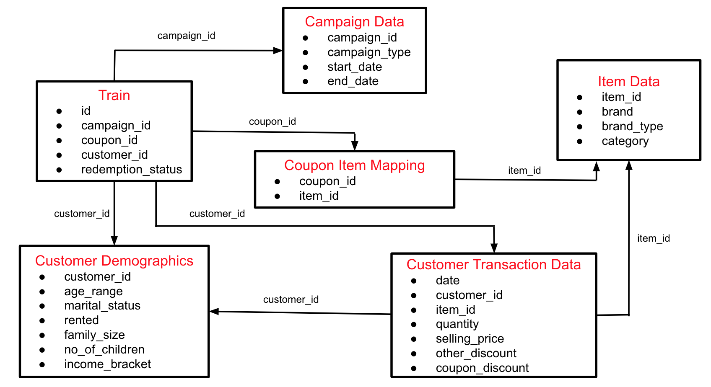

# AmExpert 2019 – Machine Learning Hackathon

## Introduction
American Express and Analytics Vidhya presents “AmExpert 2019 – Machine Learning Hackathon”. An amazing opportunity to showcase your analytical abilities and talent.

Get a taste of the kind of challenges we face here at American Express on day to day basis.

Exciting prizes up for grabs! Best performers also get a chance to get interviewed by American Express for analytics roles!

Don’t hold on to the buzzing ideas in your mind. Just wear your thinking hats and display the spectrum of your creativity!

# Problem Statement

## Predicting Coupon Redemption

XYZ Credit Card company regularly helps it’s merchants understand their data better and take key business decisions accurately by providing machine learning and analytics consulting. ABC is an established Brick & Mortar retailer that frequently conducts marketing campaigns for its diverse product range. As a merchant of XYZ, they have sought XYZ to assist them in their discount marketing process using the power of machine learning. Can you wear the AmExpert hat and help out ABC?

 
Discount marketing and coupon usage are very widely used promotional techniques to attract new customers and to retain & reinforce loyalty of existing customers. The measurement of a consumer’s propensity towards coupon usage and the prediction of the redemption behaviour are crucial parameters in assessing the effectiveness of a marketing campaign.

 
ABC’s promotions are shared across various channels including email, notifications, etc. A number of these campaigns include coupon discounts that are offered for a specific product/range of products. The retailer would like the ability to predict whether customers redeem the coupons received across channels, which will enable the retailer’s marketing team to accurately design coupon construct, and develop more precise and targeted marketing strategies.

 
The data available in this problem contains the following information, including the details of a sample of campaigns and coupons used in previous campaigns -

**User Demographic Details**

**Campaign and coupon Details**

**Product details**

**Previous transactions**

Based on previous transaction & performance data from the last 18 campaigns, predict the probability for the next 10 campaigns in the test set for each coupon and customer combination, whether the customer will redeem the coupon or not?

 

### Dataset Description

Here is the schema for the different data tables available. The detailed data dictionary is provided next.

You are provided with the following files in train.zip:

**train.csv:** Train data containing the coupons offered to the given customers under the 18 campaigns

|Variable |Definition |
|----|----|
|id	|Unique id for coupon customer impression|
|campaign_id	|Unique id for a discount campaign|
|coupon_id	|Unique id for a discount coupon|
|customer_id	|Unique id for a customer|
|redemption_status|	(target) (0 - Coupon not redeemed, 1 - Coupon redeemed) |

**campaign_data.csv:** Campaign information for each of the 28 campaigns

|Variable|	Definition|
|----|----|
|campaign_id	|Unique id for a discount campaign|
|campaign_type	|Anonymised Campaign Type (X/Y)|
|start_date	|Campaign Start Date|
|end_date	|Campaign End Date |

**coupon_item_mapping.csv:** Mapping of coupon and items valid for discount under that coupon

|Variable|	Definition|
|----|----|
|coupon_id	|Unique id for a discount coupon (no order)|
|item_id	|Unique id for items for which given coupon is valid (no order) |

**customer_demographics.csv:** Customer demographic information for some customers

|Variable	|Definition|
|----|----|
|customer_id	|Unique id for a customer|
|age_range	|Age range of customer family in years|
|marital_status|	Married/Single|
|rented|	0 - not rented accommodation, 1 - rented accommodation|
|family_size|	Number of family members|
|no_of_children	|Number of children in the family|
|income_bracket|	Label Encoded Income Bracket (Higher income corresponds to higher number) |

**customer_transaction_data.csv:** Transaction data for all customers for duration of campaigns in the train data

|Variable	|Definition|
|----|----|
|date	|Date of Transaction|
|customer_id|Unique id for a customer|
|item_id|	Unique id for item|
|quantity	|quantity of item bought|
|selling_price	|Sales value of the transaction|
|other_discount|	Discount from other sources such as manufacturer coupon/loyalty card|
|coupon_discount|	Discount availed from retailer coupon |

**item_data.csv:** Item information for each item sold by the retailer

|Variable|	Definition|
|----|----|
|item_id|	Unique id for itemv
|brand	|Unique id for item brand|
|brand_type	|Brand Type (local/Established)|
|category	|Item Category |

**test.csv:** Contains the coupon customer combination for which redemption status is to be predicted

|Variable|	Definition|
|----|----|
|id	|Unique id for coupon customer impression|
|campaign_id	|Unique id for a discount campaign|
|coupon_id	|Unique id for a discount coupon|
|customer_id	|Unique id for a customer |

**sample_submission.csv:** This file contains the format in which you have to submit your predictions.

To summarise the entire process:

* Customers receive coupons under various campaigns and may choose to redeem it.
* They can redeem the given coupon for any valid product for that coupon as per coupon item mapping within the duration between campaign start date and end date
* Next, the customer will redeem the coupon for an item at the retailer store and that will reflect in the transaction table in the column coupon_discount.
 
### Evaluation Metric
Submissions are evaluated on area under the ROC curve between the predicted probability and the observed target.
 

### Public and Private Split
* Test data is further randomly divided into Public (40%) and Private data (60%)
* Your initial responses will be checked and scored on the Public data.
* The final rankings would be based on your private score which will be published once the competition is over.
### Things to Learn
* Feature Engineering
* StratifiedKFold for Imbalanced dataset
* Feature Importance and Selection
* Removing correlated Features
* Ensemble and Stacking

### Leaderboard

* **[Public LB](https://datahack.analyticsvidhya.com/contest/amexpert-2019-machine-learning-hackathon/lb)** : **357th/993 Rank**
* **[Private LB](https://datahack.analyticsvidhya.com/contest/amexpert-2019-machine-learning-hackathon/pvt_lb)** : **338th/993 Rank**

(6K participants)

